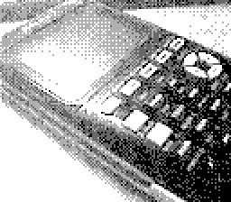

# TI-Basic-Programs

This is a collection of programs I've written over the years for various
math, statistics, and science classes. The goal when creating them was 
to expedite my ability to solve problems, and to do so with greater 
efficiency: the PYTHON program (perhaps a misnomer as it uses the 
pythagorean theorem) in particular has saved me much headache from 
problems I *know* how to solve, yet would make simple mistakes on.

The programs are divided into folders based on the class name (the 
"level" can vary from school to school). 

These files were intended for the TI-84 Plus CE. While many are likely
compatible with other Texas Instruments graphing calculators, 
functionality is not guaranteed. Files may be unreadable if not used
with TI Connect or similar software. 

Most files are old and do not have comments yet (commenting is not 
straightforward in TI-Basic), so refer to the documentation in 
their respective folder for functionality. Variables in TI-Basic 
unfortunately must be a single character, meaning they are rarely
descriptive. When appropriate, commonly used letters were preserved
(such as A, B, and C being side lengths of triangles), otherwise 
additional letters were added in alphabetical order in most cases.
On a related note I try and avoid using X and Y, as these are typically
used for the graphs.